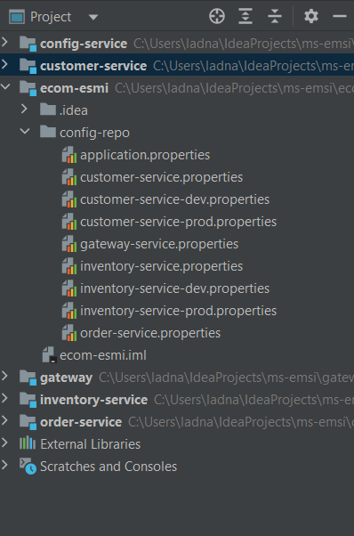
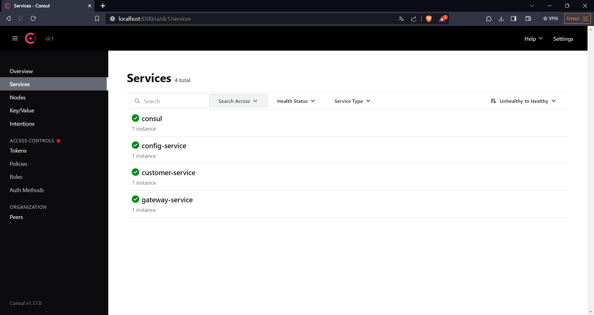
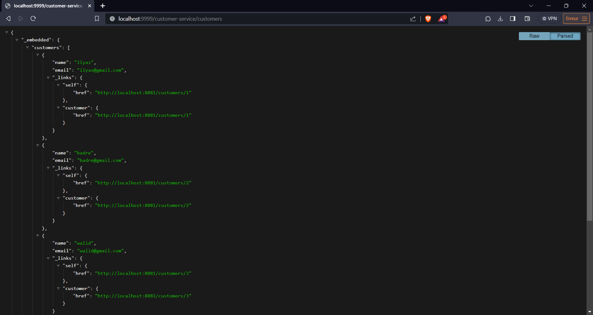
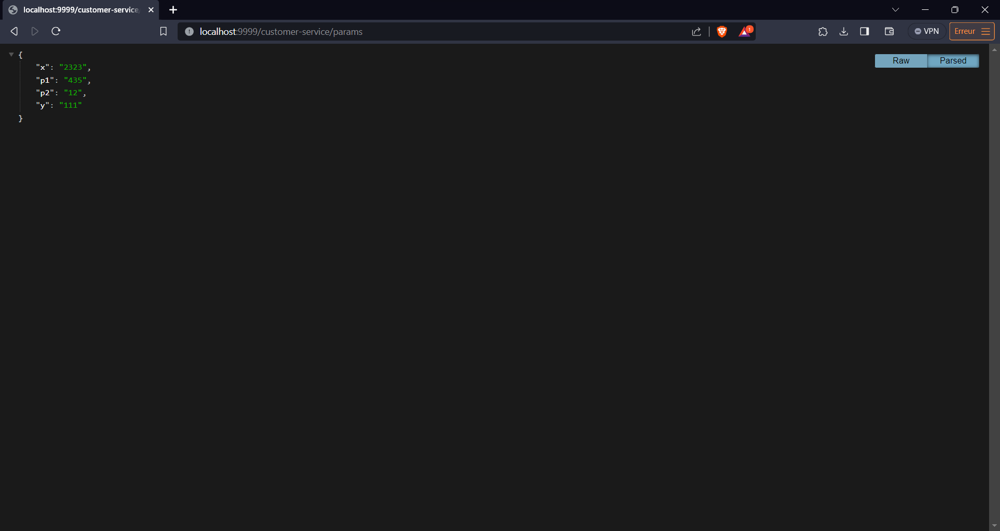

<h1>COMPTE RENDU</h1>
<h3>Structure</h3>

<h3>Consul interface</h3>

<h3>gateway interface customer-service</h3>

<h3>gateway interface customer-service:params</h3>

<h2>Configuration part</h2>

<h3>Customer</h3>
<h3>customer-service configuration</h3>

<h3>customer-service configuration dev environment </h3>

<h3>customer-service configuration prod environment </h3>

<h3>Inventory</h3>
<h3>inventory-service configuration</h3>

<h3>inventory-service configuration dev environment </h3>

<h3>inventory-service configuration prod environment </h3>

<h3>Order</h3>
<h3>order-service configuration</h3>

<h3>Gateway</h3>
<h3>gateway-service configuration</h3>
